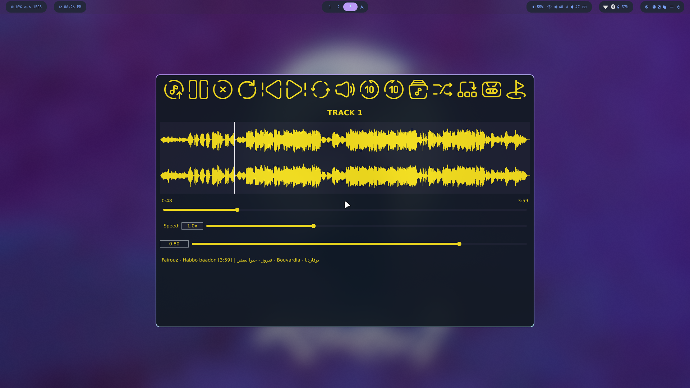

<div align="center">

# 🎵 Audio Player

**A feature-rich desktop audio player built in C++ with the JUCE framework**


A full-featured desktop audio player with **dual-track mixing**, **waveform visualization**, **A-B loop**, **playlist**, **markers**, and **session saving** — built on the JUCE framework with a custom amber-on-dark UI theme.

</div>

---

## 🖼 Showcase



> Playing *Habbo Baadon* by Fairouz — dual-channel waveform with full playback controls.

---

## ✨ Features

### Playback
- Load and play audio files via a native file chooser dialog
- **Play / Pause / Stop** with a dedicated restart (return to beginning) button
- **Skip ±10 seconds** forward and backward
- **Playback speed control** — range `0.5x` to `2.0x` via slider
- **Volume control** with mute toggle
- **Loop mode** — loops the entire track seamlessly

### Waveform Visualizer
- **Real-time dual-channel waveform** rendered with JUCE's `AudioThumbnail`
- **Seek by clicking** anywhere on the waveform
- **A-B loop region** highlighted in red on the waveform
- **Named markers** displayed as labeled green vertical lines
- Live **playhead line** tracks current position during playback

### Dual-Track Mixer
- Load a **second audio track** and mix it alongside the main track
- Each track has fully **independent controls**:
  - Play / Pause, Mute, Skip ±10s
  - Volume, Speed, and Position sliders
  - Its own waveform display

### A-B Loop
- Set a **custom loop region** (A = start point, B = end point) via a dialog
- Enter times in `MM:SS` format
- Region is highlighted on the waveform
- Both mixer tracks loop in sync when active

### Playlist
- Build and manage a **playlist** of audio files
- Double-click any track in the list to play it instantly
- Auto-advances to the next track on song end

### Markers
- **Drop named markers** at the current playback position
- View and manage all markers in a dedicated dialog
- Markers are rendered as labeled green lines on the waveform

### Session Save / Load
- **Save your session** (loaded files, position, markers) to disk
- **Restore a previous session** on next launch

### Metadata
- Reads **title and artist** from embedded audio tags automatically
- Falls back to `ffprobe` for richer metadata (e.g. MP3 ID3 tags)
- Displays track name, artist, and total duration in the UI

### Supported Formats
WAV · AIFF · FLAC · OGG Vorbis · MP3

---

## 🛠 Tech Stack

| Layer | Technology |
|---|---|
| Language | C++17 |
| Framework | JUCE 7 |
| Audio Engine | `AudioTransportSource`, `MixerAudioSource`, `ResamplingAudioSource` |
| Waveform | `AudioThumbnail` + `AudioThumbnailCache` |
| Format Support | `AudioFormatManager` (WAV, MP3, FLAC, OGG) |
| Metadata | JUCE tag reader + `ffprobe` fallback |
| GUI | JUCE Component system with custom SVG icon set |
| Build | Projucer (`.jucer`) → Linux Makefile |

---

## 📁 Project Structure

```
Audio-Player/
├── Source/
│   ├── Main.cpp                # App entry point
│   ├── MainComponent.cpp/.h    # Root window component
│   ├── PlayerAudio.cpp/.h      # Audio engine (playback, mixing, looping, A-B)
│   ├── PlayerGUI.cpp/.h        # Full UI (waveform, toolbar, playlist, dialogs)
│   └── svgs/                   # SVG icons for all toolbar buttons
│       ├── play/pause/stop/restart/loop
│       ├── forward/backward/mute/unmute
│       ├── playlist/mixer/abloop
│       └── save/marker/upload/...
├── JuceLibraryCode/            # Auto-generated JUCE module includes
├── Builds/
│   └── LinuxMakefile/
│       ├── Makefile
│       └── build/
│           └── audioPlayer     # Compiled binary
└── audioPlayer.jucer           # Projucer project file
```

---

## ⚙️ Prerequisites

### 1. JUCE Framework

The Makefile expects JUCE at `~/JUCE`. Clone it there:

```bash
git clone https://github.com/juce-framework/JUCE.git ~/JUCE
```

### 2. System Dependencies

**Arch / EndeavourOS:**
```bash
sudo pacman -S base-devel alsa-lib freetype2 libx11 libxrandr libxinerama \
               libxcursor libgl mesa gtk3 webkit2gtk ffmpeg
```

**Debian / Ubuntu:**
```bash
sudo apt install build-essential libasound2-dev libfreetype6-dev \
                 libx11-dev libxrandr-dev libxinerama-dev libxcursor-dev \
                 libgl1-mesa-dev libgtk-3-dev libwebkit2gtk-4.0-dev ffmpeg
```

> `ffmpeg` (specifically `ffprobe`) is optional but recommended — it provides richer metadata for MP3 and other formats that JUCE can't read tags from natively.

---

## 🚀 Building from Source

### 1. Clone the Repository

```bash
git clone https://github.com/beshoy-13/Audio-Player.git
cd Audio-Player
```

### 2. Build

```bash
cd Builds/LinuxMakefile
make CONFIG=Release
```

For a debug build:
```bash
make CONFIG=Debug
```

The binary is output to:
```
Builds/LinuxMakefile/build/audioPlayer
```

### 3. Run

Run from the **project root** so the app can find the SVG icons in `Source/svgs/`:

```bash
./Builds/LinuxMakefile/build/audioPlayer
```

---

## 🎮 Usage Guide

### Loading a Track

1. Click the **Upload button** (↑ arrow icon) in the toolbar
2. A file chooser dialog opens — select any supported audio file
3. The waveform renders and metadata (title, artist, duration) appears at the bottom of the window

---

### Basic Playback Controls

| Button | Action |
|---|---|
| ▶ / ❙❙ | Play / Pause |
| ■ | Stop (resets position to 0) |
| ↺ | Restart — jump to the very beginning |
| ⏮ | Go to track start |
| ⏭ | Go to track end |
| ⏪ 10 | Jump back 10 seconds |
| 10 ⏩ | Jump forward 10 seconds |

**Seeking:** drag the seek slider below the waveform, or click directly on the waveform to jump to any position.

---

### Volume & Speed

- **Volume slider** — controls output gain from `0.0` (silent) to `1.0` (full)
- **Mute button** (🔇) — instantly silences without touching the volume slider; click again to unmute
- **Speed slider** — adjusts playback rate from `0.5x` (half speed) to `2.0x` (double speed); default is `1.0x`

---

### Loop Mode

Click the **loop button** (🔁) to enable loop mode. The track restarts automatically when it reaches the end. Click again to disable.

---

### A-B Loop

Repeat a specific section of a track:

1. Click the **A-B button** in the toolbar — a dialog appears
2. Enter the **Start time** (minutes and seconds) and **End time**
3. Click **Confirm** — the region is highlighted in red on the waveform and loops continuously
4. To cancel: click the A-B button again or load a new file

---

### Dual-Track Mixer

Layer two audio tracks and mix them together:

1. Click the **Mixer button** (🎚️) — the second track's controls appear below
2. Load a file into **Track 2** using its own load button
3. Both tracks play simultaneously; use the per-track controls to balance them:
   - **Track 1** and **Track 2** each have their own Play/Pause, Mute, and ±10s skip buttons
   - Each track has independent **Volume**, **Speed**, and **Position** sliders
   - Each track shows its own **waveform display**
4. Mute one track to audition the other in isolation

---

### Playlist

1. Click the **Playlist button** (☰) to show or hide the playlist panel
2. Add files through the load dialog — they appear in the list
3. **Double-click** any item to play it immediately
4. Playback automatically advances to the next track when a song ends

---

### Markers

Bookmark positions in the audio for quick reference:

1. Play or seek to the position you want to mark
2. Click the **Marker button** (📍) — a marker is placed at the current time
3. Markers appear as **labeled green lines** on the waveform
4. Click **Show Markers** to open the markers dialog and review all saved markers

---

### Session Save & Load

- Click the **Save button** (💾) to save the current session (files, position, markers) to disk
- Use **Load Session** on next launch to restore everything exactly where you left off

---

## 🔧 Troubleshooting

| Problem | Solution |
|---|---|
| Build fails: JUCE not found | Clone JUCE to `~/JUCE`: `git clone https://github.com/juce-framework/JUCE.git ~/JUCE` |
| Toolbar icons not showing | Run the binary from the project root — it looks for `Source/svgs/` relative to the working directory |
| No audio output | Check PipeWire/PulseAudio is running; verify device is not muted in `pavucontrol` |
| MP3 files won't load | `JUCE_USE_MP3AUDIOFORMAT=1` is already set in the `.jucer` — ensure JUCE was cloned fresh |
| "Unknown Artist" in metadata | Install `ffmpeg` (`sudo pacman -S ffmpeg`) — `ffprobe` is the fallback metadata reader |
| Build fails on missing X11 headers | Install `libx11-dev libxrandr-dev libxinerama-dev libxcursor-dev` |
| `webkit2gtk` error during build | Install `libwebkit2gtk-4.0-dev` (Debian) or `webkit2gtk` (Arch) |

---

## 🗺 Roadmap

- [ ] Keyboard shortcuts
- [ ] Equalizer panel
- [ ] Peak level meter
- [ ] Cross-fade between playlist tracks
- [ ] Export mixed output to file
- [ ] Windows / macOS build configurations
- [ ] Config file for theme and defaults

---

## 👤 Author

**Beshoy Fomail Labib**

[](https://github.com/beshoy-13)
[](https://www.linkedin.com/in/beshoy-fomail)
[](mailto:beshoy.f.labib@outlook.com)
